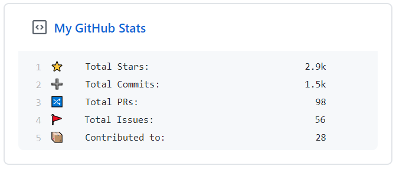

<p align="center">
  
  <h3 align="center">github-stats-box</h3>
  <p align="center">⚡️📌 Update a pinned gist to contain your GitHub stats</p>
</p>

---

## Setup

### Prep work

1. [Create a new public GitHub Gist](https://gist.github.com/new) (the Gist description will be displayed on top of your pinned Gist)
2. [Create a token](https://github.com/settings/tokens/new) with the `gist` scope and copy it

### Project setup

1. Fork this repository
2. From your new fork, go to **Settings > Secrets**
3. Add the following secrets using the **New secret** button:

    - **GH_TOKEN:** The GitHub token generated above.
    - **GIST_ID:** The ID portion from your gist url: `https://gist.github.com/yg/`**`a582ad10a45dc17815feea6018223880`**.
    - **ALL_COMMITS:** Boolean value, If `true` it will count all commits instead of last year commits

4. Go to the **Actions** tab of your fork
5. Click **set up a workflow yourself**
6. Copy-paste this workflow:

    ```yaml
    name: Update Github Stats Gist
    on:
        schedule:
            - cron: '0 * * * *'
        push:
            branches: master

    jobs:
        run:
            runs-on: ubuntu-latest
            steps:
                - uses: actions/setup-node@v1
                  with:
                      node-version: 12
                - run: npx github-stats-box
                  env:
                      GH_TOKEN: ${{ secrets.GH_TOKEN }}
                      GIST_ID: ${{ secrets.GIST_ID }}
                      ALL_COMMITS: ${{ secrets.ALL_COMMITS }}
    ```

7. Click **Start commit** then **Commit new file** to save

That's it! You Gist will be updated immediately, and every hour after that
